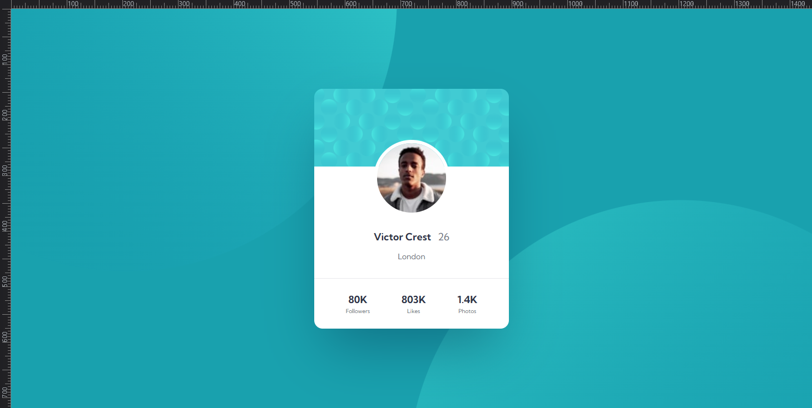
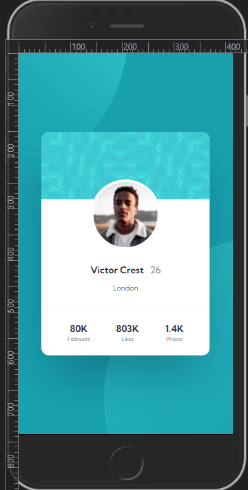

# Frontend Mentor - Profile-card-component

This is a solution to the [Profile Card Component Section Challenge on Frontend Mentor](https://www.frontendmentor.io/challenges/profile-card-component-cfArpWshJ).

## Overview

 

 
 
 

## Screenshot

### Desktop Version

### Mobile Version

### Links

- [Solution in Front End Mentor Site:](https://www.frontendmentor.io/solutions/basic-htmlcss-0rFnO90ppW)
- [Live Site](profilecard-five-wine.vercel.app)

 
 

## My process

Another challenge similar to the previous ones but this time I tried to use new things I'm learning, like improving semantic HTML5 markup, CSS Grid, custom Properties.

Since the mobile version doesn't have much difference from the desktop, I didn't use the mobile first method.

 

## Author

- Frontend Mentor - [@VitorMagnago](https://www.frontendmentor.io/profile/VitorMagnago)
